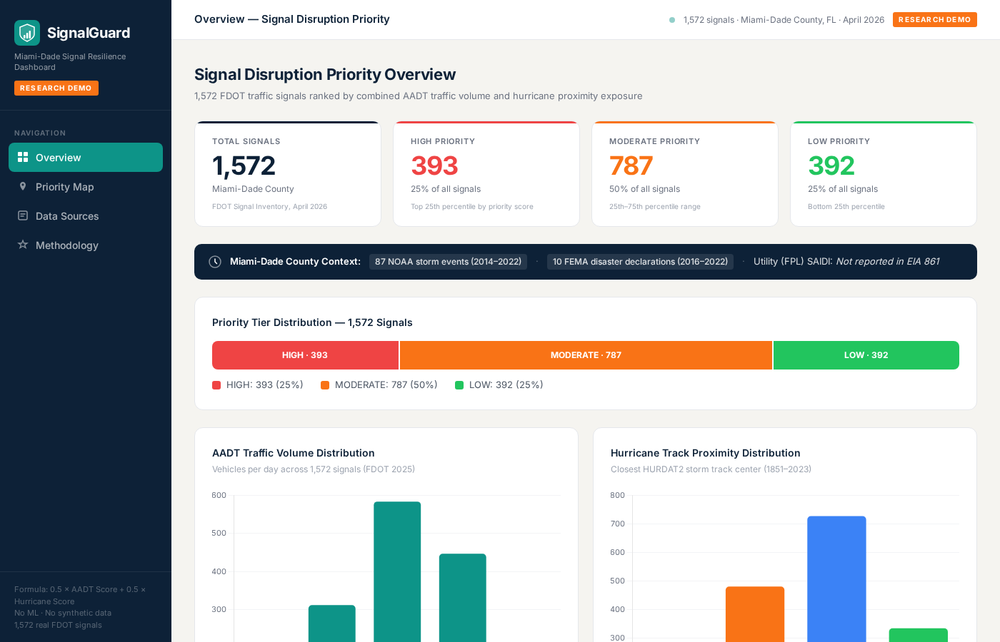

# SignalGuard — Traffic Signal Disruption Prioritization for Hurricane Resilience

**Transparent, formula-based priority index ranking 1,572 real Miami-Dade traffic signals by AADT traffic volume and HURDAT2 hurricane proximity exposure**

[](LICENSE)
[](https://services1.arcgis.com/O1JpcwDW8sjYuddV/arcgis/rest/services)
[-blue.svg)](https://www.nhc.noaa.gov/data/hurdat/)
[](https://www.fema.gov/about/openfema/data-sets)
[](https://snaidu20.github.io/Signal_Guard/)
[](https://www.fau.edu/)

### [▶ View Live Interactive Dashboard](https://snaidu20.github.io/Signal_Guard/)

[](https://snaidu20.github.io/Signal_Guard/)

---

## ⚠ Transparency Notice

> **All data in this project is sourced from publicly available government APIs and databases.** This project covers **Miami-Dade County, Florida only**. No data has been simulated or fabricated. This is a **prioritization framework** — not a prediction of which signals will lose power. No machine learning is used. No outage records exist publicly for this county. Every number in the output is directly traceable to one of four public sources listed below.

---

## Overview

Traffic signals are critical transportation infrastructure. When they go dark during a hurricane, major arterials gridlock, emergency response times increase, and evacuation routes become unmanageable. Yet no public tool currently ranks signals by their combined traffic criticality and storm exposure.

SignalGuard fills this gap with a fully transparent, formula-based pipeline that:

1. **Collects** all 1,572 real FDOT traffic signal locations in Miami-Dade County via the FDOT ArcGIS REST API (April 2026)
2. **Joins** each signal to its nearest FDOT AADT road segment (2025) — 100% match rate
3. **Computes** the closest historical hurricane track distance for each signal using NOAA HURDAT2 (54,749 track points, 1,973 storms, 1851–2023)
4. **Normalizes** both components to [0, 1] and computes a weighted Priority Score
5. **Assigns** each signal to a priority tier (HIGH / MODERATE / LOW) using percentile thresholds
6. **Visualizes** all outputs in a 4-tab interactive research dashboard with full methodology documentation

The framework is designed to support pre-storm inspection planning, backup power prioritization, and post-storm restoration sequencing by transportation agencies.

---

## Datasets

> **Note on FDOT signal data**: No year column exists in the source. Represents current FDOT signal inventory as queried April 2026 via FDOT ArcGIS REST API.

| Dataset | Records | Coverage | Source | Period |
|---------|---------|----------|--------|--------|
| FDOT Traffic Signal Locations | 1,572 signals | Miami-Dade County | [FDOT ArcGIS REST API](https://services1.arcgis.com/O1JpcwDW8sjYuddV/arcgis/rest/services/Traffic_Signal_Locations_TDA/FeatureServer/0/query?where=COUNTY%3D%27Miami-Dade%27&outFields=*&returnGeometry=true&outSR=4326&f=json) | April 2026 (current inventory) |
| FDOT Annual Average Daily Traffic | 1,848 road segments | Miami-Dade County | [FDOT ArcGIS REST API (AADT TDA)](https://services1.arcgis.com/O1JpcwDW8sjYuddV/arcgis/rest/services/Annual_Average_Daily_Traffic_TDA/FeatureServer/0/query?where=COUNTY%3D%27Miami-Dade%27&outFields=*&f=json) | 2025 |
| NOAA HURDAT2 Atlantic Hurricane Tracks | 54,749 track points · 1,973 storms | Atlantic Basin | [NOAA National Hurricane Center](https://www.nhc.noaa.gov/data/hurdat/hurdat2-1851-2023-051124.txt) | 1851–2023 |
| NOAA Storm Events | 87 events (CZ_FIPS=86) | Miami-Dade County | [NOAA Storm Events Database](https://www.ncdc.noaa.gov/stormevents/) | 2014–2022 |
| FEMA Disaster Declarations | 10 declarations | Miami-Dade County | [FEMA OpenFEMA API](https://www.fema.gov/about/openfema/data-sets) | 2016–2022 |

### Output File

| File | Description | Rows | Columns |
|------|-------------|------|---------|
| [`data/export/signalguard_priority_scores_miami_dade.csv`](data/export/signalguard_priority_scores_miami_dade.csv) | Full scored output — all signals with raw inputs, normalized scores, tier, and source attribution | 1,572 | 21 |

### Key Output Columns

| Column | Description |
|--------|-------------|
| `signal_id` | FDOT signal identifier |
| `lat`, `lon` | Signal coordinates (WGS84) |
| `aadt` | Annual Average Daily Traffic (vehicles/day) |
| `closest_storm_km` | Haversine distance to nearest HURDAT2 track point (km) |
| `aadt_score` | Min-max normalized AADT [0, 1] |
| `hurr_score` | Min-max normalized storm exposure [0, 1] |
| `priority_score` | Final weighted score: 0.5 × aadt_score + 0.5 × hurr_score |
| `tier` | HIGH / MODERATE / LOW (percentile-based) |
| `source_signals` | FDOT ArcGIS REST API |
| `source_aadt` | FDOT ArcGIS REST API (AADT TDA) |
| `source_hurricane` | NOAA HURDAT2 (1851–2023) |

---

## Methodology

### Scoring Formula

```
Priority_Score = 0.5 × AADT_score + 0.5 × hurr_score
```

Where:
```
AADT_score     = (signal_AADT − min_AADT) / (max_AADT − min_AADT)
raw_exposure   = 1 / closest_storm_km          ← invert: closer = more exposed
hurr_score     = (raw_exposure − min_exp) / (max_exp − min_exp)
```

**Dataset ranges used for normalization:**

| Component | Min | Max | Denominator |
|-----------|-----|-----|-------------|
| AADT (veh/day) | 1,500 | 271,000 | 269,500 |
| raw_exposure (1/km) | 0.0817 (= 1/12.24) | 6.667 (= 1/0.15) | 6.585 |

### Pipeline

```
FDOT ArcGIS REST API
├── Traffic Signal Locations (1,572 signals, Miami-Dade)
└── AADT Road Segments (1,848 segments, 2025)
        │
        ▼
[Step 1] AADT Join — nearest road segment by geometry
        │  → 100% match rate — all 1,572 signals assigned AADT
        │  → AADT range: 1,500 – 271,000 veh/day · Mean: 52,721
        ▼
[Step 2] Hurricane Proximity — NOAA HURDAT2
        │  → 54,749 track points · 1,973 storms · 1851–2023
        │  → Haversine distance: each signal × all track points
        │  → closest_storm_km range: 0.15 km (coastal) – 12.24 km (inland)
        │  → Note: storm COUNT excluded — all signals have 198–211 storms
        │    within 250 km (no spatial variation). Distance gives real differentiation.
        ▼
[Step 3] Min-Max Normalization
        │  → AADT Score ∈ [0, 1]
        │  → Hurricane Score ∈ [0, 1]  (inverted distance → exposure)
        ▼
[Step 4] Priority Score
        │  → 0.5 × AADT_score + 0.5 × hurr_score
        │  → Equal weighting — no empirical outage data exists to calibrate weights
        ▼
[Step 5] Tier Assignment (percentile-based)
         → HIGH     ≥ 75th percentile · 393 signals (25%)
         → MODERATE   25th–75th pct  · 787 signals (50%)
         → LOW      ≤ 25th percentile · 392 signals (25%)
```

### Why Equal Weighting?

A higher weight on AADT would rank signals purely by traffic volume, ignoring storm geography. A higher weight on hurricane exposure would favor coastal signals even with negligible traffic. Without ground-truth outage records to empirically calibrate the weights, 0.5 / 0.5 is the most defensible, transparent choice.

### Why Closest Track Distance (Not Storm Count)?

Within Miami-Dade's 5,000 km² area, every signal has 198–211 storms within 250 km — an extremely narrow range with no meaningful spatial variation. Storm count would rank all signals nearly identically. Closest track distance gives real spatial differentiation between coastal and inland signals.

---

## Results

### Tier Distribution

| Tier | Signals | Share | Score Range |
|------|---------|-------|-------------|
| HIGH | 393 | 25% | ≥ 75th percentile |
| MODERATE | 787 | 50% | 25th–75th percentile |
| LOW | 392 | 25% | ≤ 25th percentile |

### Top 5 Priority Signals

| Rank | Signal ID | AADT (veh/day) | Closest Storm (km) | AADT Score | Hurr Score | Priority Score | Tier |
|------|-----------|---------------|-------------------|------------|------------|---------------|------|
| 1 | 3833 | 39,500 | 0.15 | 0.141 | 1.000 | 0.5705 | HIGH |
| 2 | 4110 | 271,000 | 9.73 | 1.000 | 0.003 | 0.5016 | HIGH |
| 3 | 3215 | 271,000 | 10.25 | 1.000 | 0.002 | 0.5012 | HIGH |
| 4 | 3832 | 39,500 | 0.23 | 0.141 | 0.648 | 0.3944 | HIGH |
| 5 | 3626 | 87,500 | 0.40 | 0.319 | 0.367 | 0.3432 | HIGH |

**Signal #3833** (Rank 1) illustrates how storm exposure dominates: despite only moderate traffic (AADT score 0.141), a historical hurricane center passed within **150 meters** of this exact location — the closest in the entire dataset — giving it the maximum hurricane score (1.000) and placing it first overall.

**Signal #4110** (Rank 2) illustrates the opposite: maximum AADT in the dataset (271,000 veh/day, score 1.000) with near-zero hurricane score (0.003) still produces a HIGH-priority result via traffic volume alone.

---

## What Each Tier Means in Practice

| Tier | Practical Impact | Recommended Action |
|------|-----------------|-------------------|
| **HIGH** | Highest-volume roads or most storm-exposed corridors (or both). Signal outage causes gridlock on major arterials, increases emergency response times, creates cascading queue spillback | First priority for backup power assessment, pre-storm inspection, fastest restoration |
| **MODERATE** | Medium traffic or moderate storm exposure. Outage causes delays at neighborhood/secondary corridor level | Second-wave inspection; include in backup power planning if resources allow |
| **LOW** | Low traffic AND historically far from storm centers. Minor delays; easier to navigate without signals | Lowest urgency — restore after HIGH and MODERATE are cleared |

---

## Research Applications

| Application | Description |
|-------------|-------------|
| **Pre-Storm Signal Inspection** | HIGH-tier signals identified for pre-storm inspection and backup power verification |
| **Post-Storm Restoration Sequencing** | Tier-ranked list gives TMCs a defensible, data-driven restoration order |
| **Emergency Response Planning** | HIGH signals on major corridors identified for manual traffic control deployment |
| **Transportation Resilience Research** | Transparent baseline framework — reproducible with any county's FDOT + HURDAT2 data |
| **Infrastructure Investment Prioritization** | Data-driven basis for backup power or hardening investment decisions |

---

## File Structure

```
Signal_Guard/
├── README.md                                         # This file
├── LICENSE
├── .nojekyll
├── dashboard_preview.png                             # Dashboard screenshot
│
├── .github/
│   └── workflows/
│       └── deploy-dashboard.yml                      # GitHub Pages auto-deploy
│
├── dashboard/
│   └── index.html                                    # Interactive 4-tab research dashboard
│                                                     # (self-contained — all 1,572 signals embedded)
│
└── data/
    ├── README.md                                     # Dataset documentation & column descriptions
    └── export/
        ├── signalguard_priority_scores_miami_dade.csv  # ← MAIN OUTPUT (1,572 rows × 21 cols)
        ├── fdot_traffic_signals_miami_dade.csv          # Raw FDOT signal locations
        ├── fdot_aadt_miami_dade.csv                     # Raw FDOT AADT road segments
        ├── hurdat2_hurricane_tracks.csv                 # NOAA HURDAT2 track points
        ├── noaa_storm_events_miami_dade.csv             # NOAA storm events (87 rows)
        └── fema_disaster_declarations_miami_dade.csv    # FEMA declarations (10 rows)
```

---

## Quick Start

### View Dashboard

**Live**: [https://snaidu20.github.io/Signal_Guard/](https://snaidu20.github.io/Signal_Guard/)

```bash
# Or run locally — no build step, all data embedded
open dashboard/index.html
# Or serve via Python:
python -m http.server 8080 --directory dashboard/
# Visit: http://localhost:8080
```

### Reproduce the Priority Scores

All formulas are fully documented in the README and in the Methodology tab of the dashboard. To verify from scratch:

```python
import pandas as pd
import numpy as np

# Load the output file
df = pd.read_csv('data/export/signalguard_priority_scores_miami_dade.csv')

# Normalization ranges (from dataset)
min_aadt, max_aadt = df['aadt'].min(), df['aadt'].max()           # 1,500 · 271,000
min_km,   max_km   = df['closest_storm_km'].min(), df['closest_storm_km'].max()  # 0.15 · 12.24

# Re-compute scores from raw inputs
df['aadt_score_check'] = (df['aadt'] - min_aadt) / (max_aadt - min_aadt)
df['raw_exp']          = 1 / df['closest_storm_km']
min_exp = 1 / max_km;  max_exp = 1 / min_km
df['hurr_score_check'] = (df['raw_exp'] - min_exp) / (max_exp - min_exp)
df['score_check']      = 0.5 * df['aadt_score_check'] + 0.5 * df['hurr_score_check']

# Should match stored priority_score to 4 decimal places
print(df[['signal_id', 'priority_score', 'score_check']].head(10))
```

### Access Raw Data APIs

```bash
# FDOT Traffic Signal Locations — Miami-Dade
curl "https://services1.arcgis.com/O1JpcwDW8sjYuddV/arcgis/rest/services/Traffic_Signal_Locations_TDA/FeatureServer/0/query?where=COUNTY%3D%27Miami-Dade%27&outFields=*&returnGeometry=true&outSR=4326&f=json"

# FDOT AADT — Miami-Dade
curl "https://services1.arcgis.com/O1JpcwDW8sjYuddV/arcgis/rest/services/Annual_Average_Daily_Traffic_TDA/FeatureServer/0/query?where=COUNTY%3D%27Miami-Dade%27&outFields=*&f=json"

# FEMA OpenFEMA Disaster Declarations — Miami-Dade County
curl "https://www.fema.gov/api/open/v2/disasterDeclarationsSummaries?state=FL&designatedArea=MIAMI-DADE%20COUNTY"

# NOAA HURDAT2 (direct download)
wget https://www.nhc.noaa.gov/data/hurdat/hurdat2-1851-2023-051124.txt
```

---

## Citation

```bibtex
@misc{naidu2026signalguard,
  author       = {Naidu, Sai Kumar},
  title        = {{SignalGuard}: Traffic Signal Disruption Prioritization for Hurricane Resilience — Miami-Dade County},
  year         = {2026},
  institution  = {Florida Atlantic University, Department of Civil, Environmental and Geomatics Engineering},
  note         = {Research Demo. Formula-based priority index using FDOT ArcGIS REST API (signals + AADT),
                  NOAA HURDAT2 (1851–2023), NOAA Storm Events (2014–2022), and FEMA OpenFEMA (2016–2022).
                  Miami-Dade County, Florida. No machine learning. No synthetic data.},
  url          = {https://github.com/snaidu20/Signal_Guard}
}
```

---

## Disclaimer

All data is sourced from publicly available government APIs and databases (FDOT, NOAA, FEMA). No data has been simulated, fabricated, or imputed. This project covers **Miami-Dade County, Florida only**. This is a **research prioritization framework** — outputs are not a prediction of signal failure and are not intended for operational safety decision-making without further validation.

---

## License

MIT License — Copyright © 2026 Sai Kumar Naidu

---

## Author

**Sai Kumar Naidu**  
MS Computer Science, Florida Atlantic University  
Research focus: Transportation Safety, Infrastructure Resilience  
GitHub: [snaidu20](https://github.com/snaidu20) · Email: naidusaikumar1998@gmail.com
